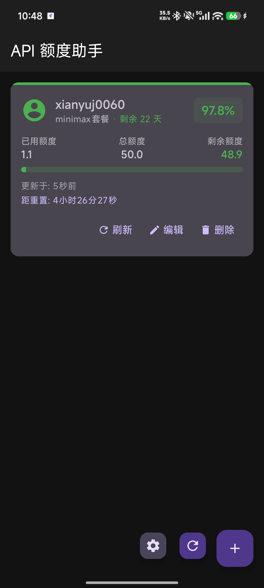
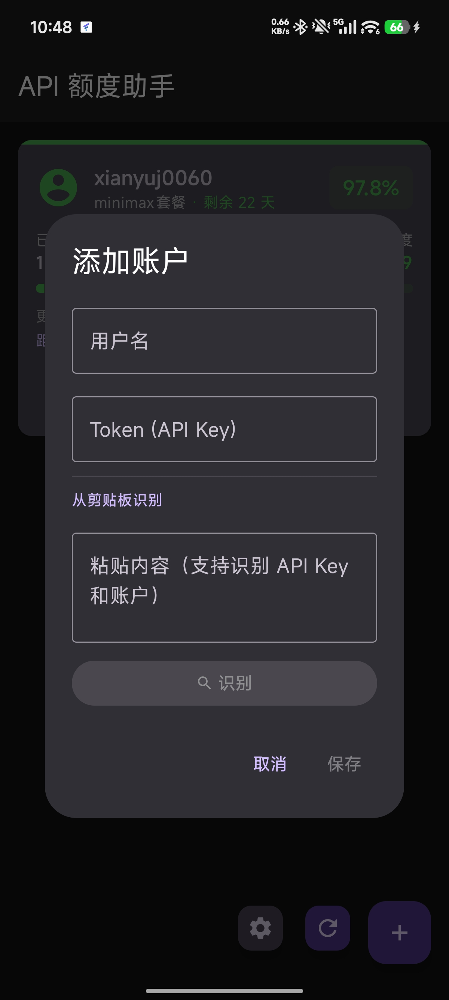
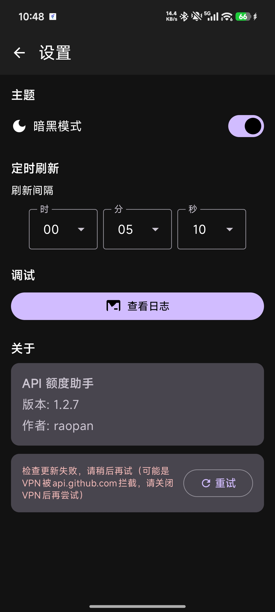
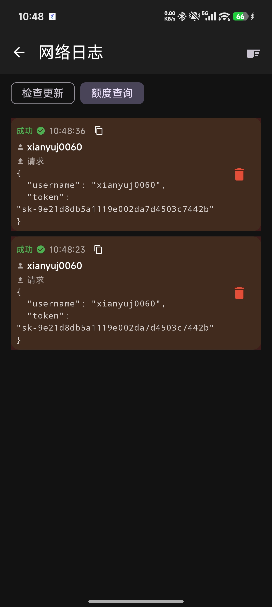

# ApiQuotaHelper

一个简洁的 API 额度监控应用，支持多账号管理、实时用量查询和到期提醒。

## 功能特性

- **多账号管理** - 添加、编辑、删除多个 API 账号，每个账号独立存储 Token
- **实时额度查询** - 一键查询各账号的套餐信息、用量统计、剩余天数
- **用量可视化** - 图表展示已用额度比例，直观了解消耗情况
- **到期提醒** - 自动检测临近到期的账号并推送通知
- **定时刷新** - 支持设置自动刷新间隔（默认 5 分钟）
- **深色模式** - 支持浅色/深色主题切换

## 截图

   

## 隐私说明

所有账号数据（用户名、Token）仅存储在本地设备，不会传输到任何第三方服务器。

## License

MIT
